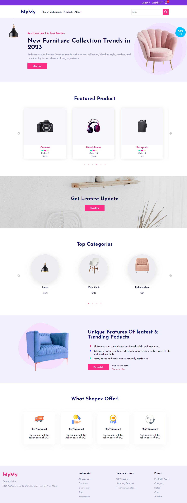
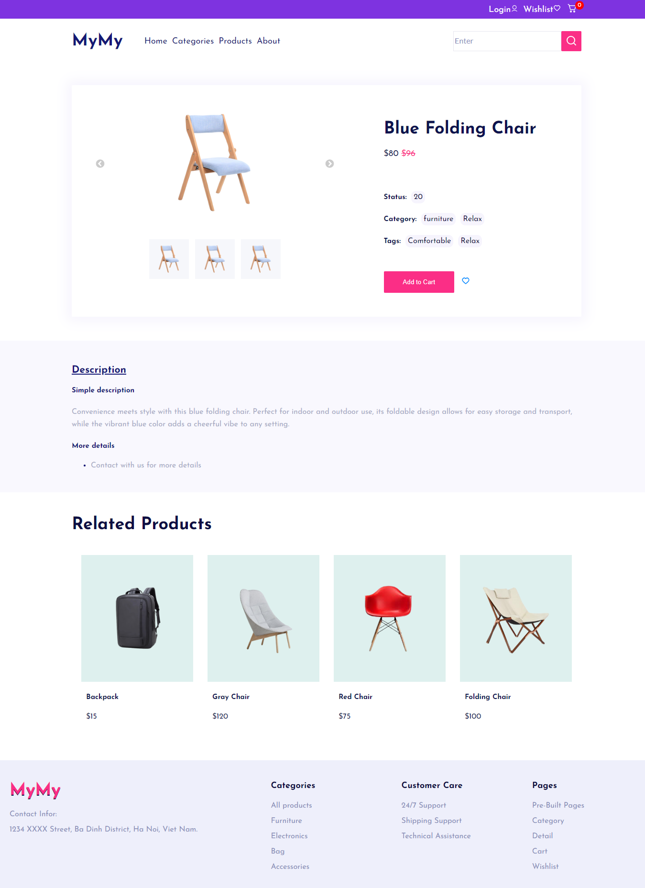
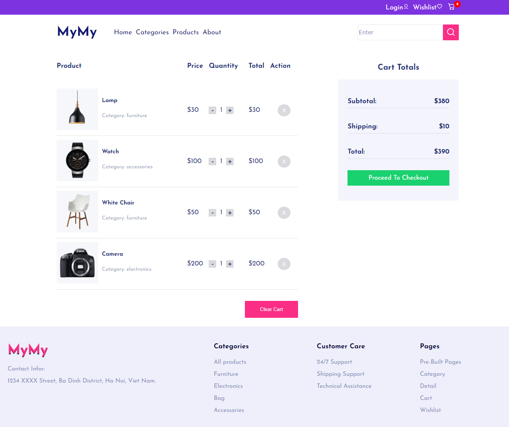

# Overview
This minimalist e-commerce website, built with React and styled with CSS.

## Demo
Explore the live demo to experience the simplicity and functionality firsthand: [Live Demo](e-commerce-totrinhbui.vercel.app)

## Installation
To set up the project on your local machine, follow these steps:
1. Clone the repository to your local machine using Git.
2. Navigate to the project directory in your terminal.
3. Install the project dependencies by running `npm install --force`.
4. Start the application by running `npm start`.

## Credits
This application was crafted using:
- React
- CSS
- The design inspiration comes from [Saber Ali](https://www.figma.com/community/file/967759864749832815).

## Screenshots
Take a glimpse at some key pages of the website:

- **Home Page**
  
- **Product Detail Page**
  
- **Cart Page**
  

For more screenshots, visit [this link](https://github.com/ToTrinhBui/e-commerce/tree/main/src/images/overview).
